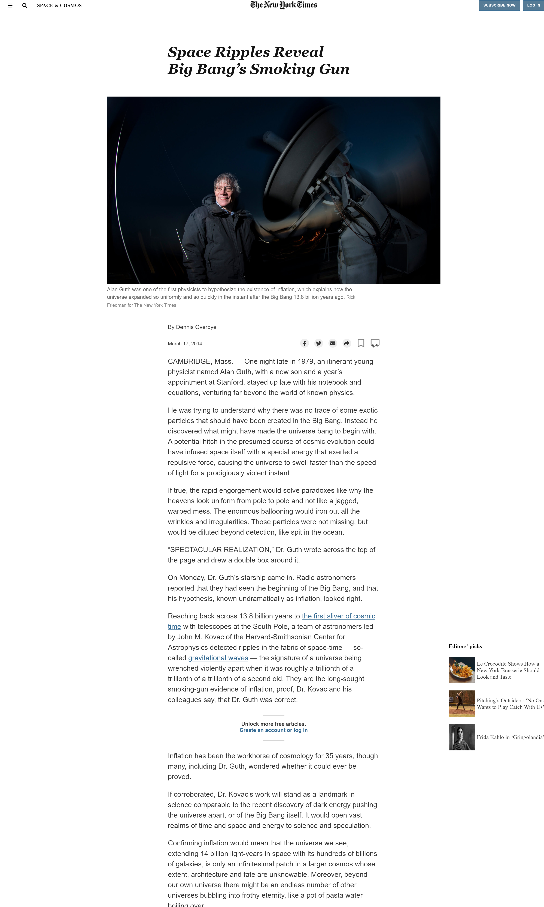

# New-York-Times-Page

Clone of New York Times Page

## Built With

HTML5, CSS3
Flexbox
Grid
Fontawesome
## Live Demo

[Live Demo Link](https://raw.githack.com/arslanbisharat/New-York-Times-Page/feature-branch/index.html)

## Authors

👤 **Ricardo **

- Github: [@githubhandle](https://github.com/ricardo123321)
- Twitter: [@twitterhandle](https://twitter.com/ricardo61592083)
- Linkedin: [linkedin](https://www.linkedin.com/in/ricardo-vera/)

👤 **Muhammad Arslan**

- Github: [@githubhandle](https://github.com/arslanbisharat)
- Twitter: [@twitterhandle](https://twitter.com/arslan_bisharat-2020bb156)
- Linkedin: [linkedin](https://www.linkedin.com/in/muhammad-arslan)

## 🤝 Contributing

Contributions, issues and feature requests are welcome!

Feel free to check the [issues page](https://github.com/arslanbisharat/New-York-Times-Page/issues).

## Show your support

Give a ⭐️ if you like this project!

